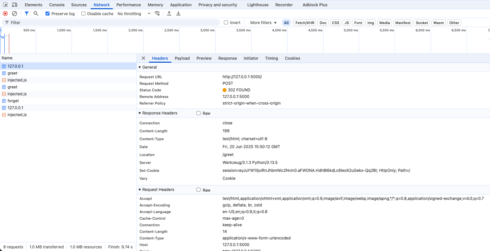
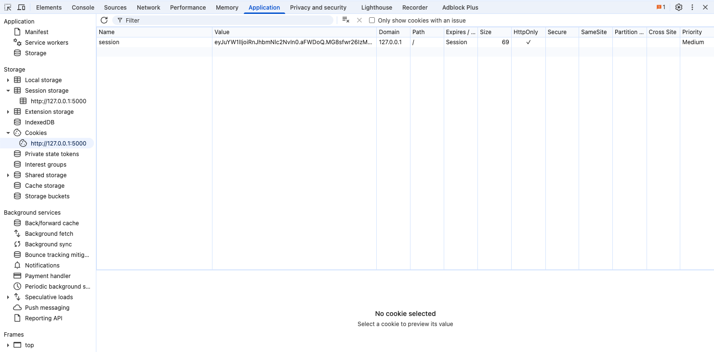

# How to Greet in Flask

This repository is a simple web application built with [Flask][1] that asks
users for their name, remembers them using sessions, and greets users by name.
This application also shows how to publish flash messages for one-time
notifications and explores some more advanced templating techniques.

## Prerequisites

This repository builds upon the concepts explored in [Introduction to Flask][2]
and [To-Do List in Flask][3], which will not be repeated here. The application
can be set up and executed as described in [Introduction to Flask][2].

## Explore the code

The [web server](app.py) defines the routes to serve the two pages of this
application, to handle form submissions, and to manage the session.

The [base template](templates/base.html) defines the layout for all the pages in
this application, and the [index page template](templates/index.html) and the
[greeting page template](templates/greet.html) both extend from the base
template to avoid repetition.

## Sessions, flashes, cookies

You should use this web application and observe the HTTP traffic via your
browser's development tools (for example, Chrome DevTools). Inspect the requests
sent by the browser and check when cookies are sent back to the server. Inspect
the responses sent by the web application to see when the server sets or unsets
a cookie.



Your browser's development tool will also help you to inspect the site data that
the browser stores for the web application, including the currently stored
cookies.



Flask sessions and flashes are implemented on top of cookies. The cookies set by
Flask are just signed, but not encrypted. In fact, with a little bit of effort,
you can read the information stored in a cookie in plain text. For example, when
this application sets the name for a user, the `Set-Cookie` header is:

```
Set-Cookie: session=eyJuYW1lIjoiVXNlciJ9.aFWFlQ.o4BF7mz8JJPYtyAv-QD66m0PuzI; HttpOnly; Path=/
```

If you take the value of the `session` cookie, remove everything after the first
dot `.`, and decode the rest from Base64, you can read the content of the
cookie:

```sh
echo 'eyJuYW1lIjoiVXNlciJ9.aFWFlQ.o4BF7mz8JJPYtyAv-QD66m0PuzI' | cut -d. -f1 | base64 -D
```

Running the command above prints:

```sh
{"name":"User"}
```

Similarly, the web application sets a cookie every time it flashes a message.
For example when forgetting a user:

```
Set-Cookie: session=eyJfZmxhc2hlcyI6W3siIHQiOlsibWVzc2FnZSIsIkkgZm9yZ290IHlvdS4uLiJdfV19.aFWG8A.AhuBx8dSyONVraFvFgqkFnmU3Ds; HttpOnly; Path=/
```

Extract and decode the cookie value:

```sh
echo 'eyJfZmxhc2hlcyI6W3siIHQiOlsibWVzc2FnZSIsIkkgZm9yZ290IHlvdS4uLiJdfV19.aFWG8A.AhuBx8dSyONVraFvFgqkFnmU3Ds' | cut -d. -f1 | base64 -D
```

You can see the flash message in the decoded cookie value:

```
{"_flashes":[{" t":["message","I forgot you..."]}]}
```

To know more about cookies, read [Using HTTP cookies][4].

## Signing cookies

> [!WARNING]
> This section explains how the cookie is signed and why. I will touch on some
> security properties of signatures, which might be a bit complicated to
> understand at first.

When Flask creates a cookie, it computes a signature that depends on a secret
key (`app.secret_key`) and the value of the cookie. The signature looks like a
random sequence of numbers, letters, and symbols. Even if it looks random, the
same cookie value and the same secret key always generate the same signature.

When Flask receives a cookie, it first splits it into two parts: the actual
cookie value and the signature. It then re-computes the signature from the
cookie value and the secret key, and compares the computed signature with the
one it receives from the browser. If the two signatures match, Flask determines
that the cookie is safe to use.

Why?

What I have been calling a "signature" until now is better known as a
[Message Authentication Code (MAC)][6]. A MAC helps Flask establish two
important properties: authenticity and integrity.

Authenticity guarantees that a cookie was really created by Flask. Flask uses
the secret key to create a signature and to verify whether the signature is
valid. Signatures are very difficult (practically impossible) to fake. To
generate a signature, you really need to have access to the secret key. If a
cookie value matches its signature, Flask is sure that the cookie was really
generated by the server because only Flask has access to the secret key.

Integrity helps Flask determine whether the cookie it created was sent back to
the server without being modified. Because different cookie values generate very
different signatures, if a cookie value generates the same signature as the one
Flask expects, Flask can guarantee that nobody changed the cookie value.

The cookies created by Flask are signed using the [ItsDangerous][5] library.

[1]: https://flask.palletsprojects.com/en/stable/
[2]: https://github.com/francescomari/flask-introduction
[3]: https://github.com/francescomari/flask-todo
[4]: https://developer.mozilla.org/en-US/docs/Web/HTTP/Guides/Cookies
[5]: https://itsdangerous.palletsprojects.com/en/stable/
[6]: https://en.wikipedia.org/wiki/Message_authentication_code
